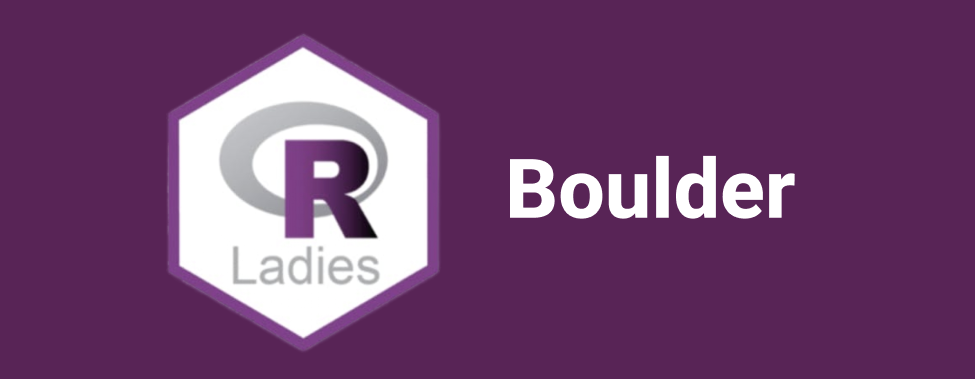

# R-Ladies Boulder

Presentations and materials from R-Ladies Boulder events and discussions. 

## Upcoming events (we plan for the second Tuesday of the month)
  - **Meeting 22: Frequentist & Bayesian Random Effects Models in R: RStan Tutorial**
      + *Tuesday, January 11, 2022*
      + [Meetup event](https://www.meetup.com/rladies-boulder/events/283098539/)
 
 
 
 
## Past Events

| Year | Title                                            | Link                                                             | YouTube |
| :--- | :----------------------------------------------- | :--------------------------------------------------------------- | :------ |
| 2021 | Ugly Holiday Plot contest                        | [Meetup](https://www.meetup.com/rladies-boulder/events/)         |         |
| 2021 | Reproducible Code & Visualization Best Practices | [Code](2021/Meeting_20_Reproducible_Code_and_Best_Practice_Viz/) |  [YouTube](https://youtu.be/aJ3l4TjLWyI)       |
| 2021 | From csv to Slippy Map - Intro to Spatial Data in R | [Meetup](https://www.meetup.com/rladies-boulder/events/279892572/) | |
 
 
 
 

## 2021

 

  - **Meeting 14: rstudio::global 2021 Conference Talk Watch Party**
      + *Tuesday, May 11, 2021*
      + [Materials](https://rstudio.com/resources/rstudioglobal-2021/?mkt_tok=eyJpIjoiTTJFNFlXRmpZamhrTmpKaSIsInQiOiJKc3pxZG92MzdkWFZUTGRPUnJHZEhQQUo0SGJnclZzOVFIQnFtNTdDM21vYk5iamlycnNxVWhYKzlmcTY2a092XC9OZVdwczQzbDE4Uml0VU4yWG51MGl0SkdKT3FxVUtVQW1qU1VBcG5CSWp4YU9RUlwvRHV0MDlMT1dwZWNBTnlvIn0%3D)
      + [Meetup event](https://www.meetup.com/rladies-boulder/events/278024064/)

 - **Meeting 13: Lasso, Ridge, and Elastic Net Regression**
      + *Tuesday, April 13, 2021*
      + Marta Jankowska gave us a tutorial on Elastic Net, Ridge, and Lasso Regression approaches.
      + [Materials](https://github.com/rladies/meetup-presentations_boulder/tree/master/Meeting_13_Lasso_Ridge_Elastic_Net_Regression)
      + [Meetup event](https://www.meetup.com/rladies-boulder/events/276975668/)
 
## 2020
 - **Meeting 10: Introduction to Flexdashboards**
      + *Tuesday, November 10, 2020*
      + Hilary Traut guided us through the basics of flexdashboard. Flexdashboards are a widely useful method (based in R Markdown) for presenting interactive analysis reports, usually focusing on graphs or other types of data visuals.
      + [Materials](https://github.com/rladies/meetup-presentations_boulder/tree/master/Meeting_10_Introduction_to_Flexdashboards)
      + [Meetup event](https://www.meetup.com/rladies-boulder/events/274264141/)
 
 - **Meeting 9: Unsupervised Clustering Methods in R**
      + *Tuesday, October 13, 2020*
      + Dr. Marta Jankowska showed us the ropes of some common machine learning algorithms in R. She focused on unsupervised clustering methods.
      + [Materials](https://github.com/rladies/meetup-presentations_boulder/tree/master/Meeting_9_Unsupervised_Clustering_Methods_in_R)
      + [Meetup event](https://www.meetup.com/rladies-boulder/events/273646366/)

  - **Meeting 8: Lightning Talks!**
      + *Tuesday, September 8, 2020*
      + Teaching R to undergraduates (Speaker: Kelly Carscadden)
      + [Meetup event](https://www.meetup.com/rladies-boulder/events/272634605/)
 
  - **Meeting 7: Virtual Happy Hour!**
      + *Tuesday, July 14, 2020*
      + [Meetup event](https://www.meetup.com/rladies-boulder/events/271672015/)
      
  - **Meeting 6: Introduction to Shiny!**
      + *Tuesday, March 10, 2020*
      + Lisa Moller gave us a tutorial on how to build an R Shiny app from scratch.
      + [Materials](https://github.com/rladies/meetup-presentations_boulder/tree/master/Meeting_6_Introduction_to_Shiny/)
      + [Meetup event](https://www.meetup.com/rladies-boulder/events/268492926/)
      
  - **Meeting 5: Coding Hour and Networking**
      + *Tuesday, February 11, 2020*
      + We met, chatted and coded!
      + [Meetup event](https://www.meetup.com/rladies-boulder/events/268492926/)

  - **Meeting 4: Introduction to Building R Packages**
      + *Tuesday, January 14, 2020*
      + Leigh Alexander gave us a tutorial on how to build an R package from the ground up.
      + [Materials](https://github.com/rladies/meetup-presentations_boulder/tree/master/Meeting_4_Introduction_to_Building_R_Packages/)
      + [Meetup event](https://www.meetup.com/rladies-boulder/events/267593347/)

## 2019
  - **Meeting 3: Ugly Holiday Plot Contest**
      + *Tuesday, December 10, 2019*
      + We shared our ugliest holiday-themed plots!
      + [Meetup event](https://www.meetup.com/rladies-boulder/events/266646393/)
  
  - **Meeting 2: TidyTuesday**
      + *Tuesday, October 8, 2019*
      + We participated in TidyTuesday. A fun, low-stress coding challenge posted weekly by the R4DS online learning community.
      + For more information on TidyTuesday, see here: https://github.com/rfordatascience/tidytuesday
      + [Meetup event](https://www.meetup.com/rladies-boulder/events/265316428/)
  
  - **Meeting 1: R-Ladies-Boulder Kickoff Meeting**
      + *Tuesday, September 10, 2019*
      + Welcome from the organizers...
        + [Courtney VanDenElzen](https://twitter.com/clvandenelzen)
        + [Marta Jankowska](https://twitter.com/hdscalecollab)
        + [Leigh Alexander](https://twitter.com/ExuberantLeigh)
        + [Lisa Moller](https://twitter.com/lakmoller)
      + Introductions around the room and discussions about what we want from the group!
      + [Materials](https://github.com/rladies/meetup-presentations_boulder/tree/master/Meeting_1_R_Ladies_Boulder_Kickoff_Meeting/)
      + [Meetup event](https://www.meetup.com/rladies-boulder/events/264186869/)
